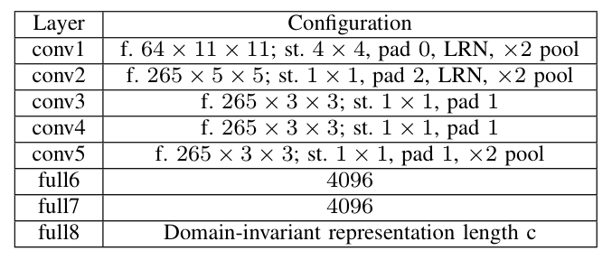
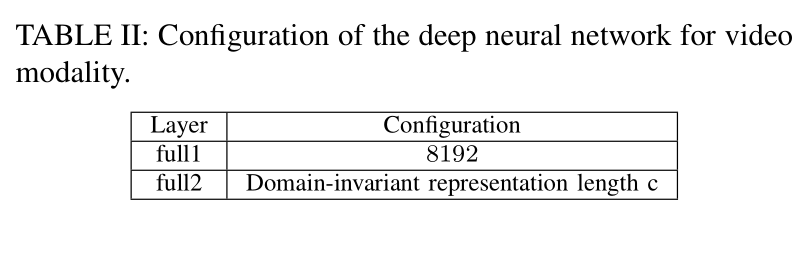
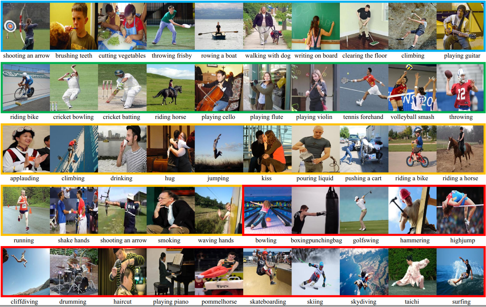

## Deep Image-to-Video Adaptation and Fusion Networks for Action Recognition  
(accepted by IEEE Transactions on Image Processing)  

<a href="https://orcid.org/0000-0002-9423-9252" target="orcid.widget" rel="noopener noreferrer" style="vertical-align:top;">orcid.org/0000-0002-9423-9252</a>

Homepage: [https://yangliu9208.github.io/home/](https://yangliu9208.github.io/home/)

## Abstract
Existing deep learning methods for action recognition in videos require a large number of labeled videos for training, which is labor-intensive and time-consuming. For the same action, the knowledge learned from different media types, e.g., videos and images, may be related and complementary. However, due to the domain shifts and heterogeneous feature representations between videos and images, the performance of classifiers trained on images may be dramatically degraded when directly deployed to videos without effective domain adaptation and feature fusion methods. In this paper, we propose a novel method, named Deep Image-to-Video Adaptation and Fusion Networks (DIVAFN), to enhance action recognition in videos by transferring knowledge from images using video keyframes as a bridge. The DIVAFN is a unified deep learning model, which integrates domain-invariant representations learning and cross-modal feature fusion into a unified optimization framework. Specifically, we design an efficient cross-modal similarities metric to reduce the modality shift among images, keyframes and videos. Then, we adopt an autoencoder architecture, whose hidden layer is constrained to be the semantic representations of the action class names. In this way, when the autoencoder is adopted to project the learned features from different domains to the same space, more compact, informative and discriminative representations can be obtained. Finally, the concatenation of the learned semantic feature representations from these three autoencoders are used to train the classifier for action recognition in videos. Comprehensive experiments on four real-world datasets show that our method outperforms some state-of-the-art domain adaptation and action recognition methods.

## Network architecture

Figure 1: Configuration of the deep neural network for image modality. "f" denotes the number of convolutional filters and
their receptive field size, "st" denotes the convolutional stride, "pad" denotes the number of pixels to add to each size of the
input, "LRN" denotes whether Local Response Normalization (LRN) is applied or not, and “pool” denotes the downsampling factor.

Figure 2: Configuration of the deep neural network for keyframe modality. 

Figure 3: Configuration of the deep neural network for video modality

## Environment

DIVAFN: MatlabR2016b, Matconvnet-1.0-beta25, Windows10   
C3D feature extraction: Caffe, Ubuntu16.04 LTS
Word2Vec vectors extraction: python, Ubuntu16.04 LTS

## Datasets

Stanford40->UCF101 dataset can be downloaded here. [Stanford40](https://drive.google.com/open?id=1f8XJ-GSIrB1fJFZJzgECYA6w9-OJWiJr)

ASD->UCF101 dataset can be downloaded here. [ASD](https://drive.google.com/open?id=1xor9cfZ-ny-OfBbTnKRR_6oQyebKkD-g)

EAD->HMDB51 dataset can be downloaded here. [EAD](https://drive.google.com/open?id=11GghjBp1jgFKDwvudZGLzPbSuCP4DJfs), [HMDB51](http://serre-lab.clps.brown.edu/resource/hmdb-a-large-human-motion-database/)

BU101->UCF101 dataset can be downloaded here.   [BU101](http://cs-people.bu.edu/sbargal/BU-action/), [UCF101](http://crcv.ucf.edu/data/UCF101.php)

## Usage
1. Extract keyframes for rach video dataset. Codes can be downloaded [here](https://drive.google.com/open?id=1STpJ3uxoHmIQ1Jf0B9yaGHzMifYiaAwJ).
2. Extract [C3D](https://github.com/facebookarchive/C3D) or [IDT+LLC encoding](https://drive.google.com/open?id=1YJaQS0InuiysLfXqOZtQVY6hQgQRLIpx) features for videos.
3. If you have extracted the C3D features, then you need to transform the C3D binaries into MAT format. Codes can be downloaded [here](https://drive.google.com/open?id=1I7orbMn6KVZGWbErttxnbhw1bvkPh1Af).
4. Extract the semantic representations (word2vec or attribute) for action classed names for each video datasets. Codes can be downloaded [here](). Run "UCF101_word2vec.py" to caculate the word2vec vectors for UCF101 dataset, run "HMDB51_word2vec.py" to caculate word2vec vectors for HMDB51 datasets. Then run "TXT_to_Mat.m" to compress the txt vectors into MAT format.  
5. Execute DIVAFN algorithm. Codes can be downloaded [here]().  
   (1)Preprocess. Run "Data_preprocess_Stanford40_UCF101.m", "Data_preprocess_ASD_UCF101.m", "Data_preprocess_EAD_HMDB51.m" and "Data_preprocess_BU101_UCF101.m" to obtain a MAT file which contains images, keyframes, video features, semantic vectors,  train_test_split information and action class labels for each image-video task.    
   (2)Run "main_DIVAFN_Stanford40_UCF101.m", "main_DIVAFN_ASD_UCF101.m", "main_DIVAFN_EAD_HMDB51.m", "main_DIVAFN_BU101_UCF101.m" to excute the DIVAFN algorithm for each image-video task.  
   (3)Run "Classify_train_SAECombinedHashCodes_Stanford40_UCF101.m" to classify the actions in video datasets. Other tasks is executed in the similar way.  
   
   

