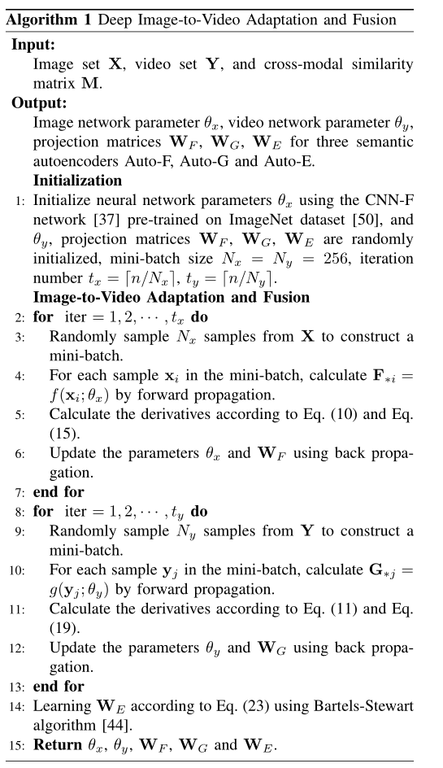

# Deep Image-to-Video Adaptation and Fusion Networks for Action Recognition

<a href="https://orcid.org/0000-0002-9423-9252" target="orcid.widget" rel="noopener noreferrer" style="vertical-align:top;">orcid.org/0000-0002-9423-9252</a>

Homepage: [https://sites.google.com/site/yangliuxdu/home](https://sites.google.com/site/yangliuxdu/home)

## Network architecture

Figure 1: Configuration of the deep neural network for image modality. "f" denotes the number of convolutional filters and
their receptive field size, "st" denotes the convolutional stride, "pad" denotes the number of pixels to add to each size of the
input, "LRN" denotes whether Local Response Normalization (LRN) is applied or not, and “pool” denotes the downsampling factor.

Figure 2: Configuration of the deep neural network for video modality

## Algorithm

## Datasets

Stanford40->UCF101 dataset can be downloaded here. [Stanford40](https://drive.google.com/open?id=1f8XJ-GSIrB1fJFZJzgECYA6w9-OJWiJr).

ASD->UCF101 dataset can be downloaded here. [ASD](https://drive.google.com/open?id=1xor9cfZ-ny-OfBbTnKRR_6oQyebKkD-g)

EAD->HMDB51 dataset can be downloaded here. [EAD](https://drive.google.com/open?id=11GghjBp1jgFKDwvudZGLzPbSuCP4DJfs), [HMDB51](http://serre-lab.clps.brown.edu/resource/hmdb-a-large-human-motion-database/)

BU101->UCF101 dataset can be downloaded here.   [BU101](http://cs-people.bu.edu/sbargal/BU-action/), [UCF101](http://crcv.ucf.edu/data/UCF101.php)

## Codes
Soon will be available.
